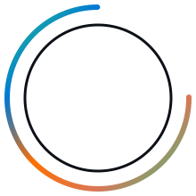

 

---

## 🧑‍💻 About Me

<table>
<tr>
<td width="60%">

- 🐍 I build **fast, reliable Python desktop applications** using `CustomTkinter`, multi-threading, and real-world API integrations.
- 🌐 I also develop **full-stack web solutions** with `PHP`, `MySQL`, and clean `HTML/CSS`.
- 🤖 Currently focused on **AI-integrated desktop tools** — wiring up LLM APIs (like Claude) into polished, user-friendly GUIs.
- 📈 Exploring **algorithmic trading and automation** — bots, web scraping, and market-data tooling.
- 🎨 I care deeply about **clean code architecture** and **modern, intentional UI design** — no clutter, no shortcuts.
- 💼 Actively available for **freelance development** — desktop apps, automation tools, and web platforms.
- ⚡ Always learning, always shipping.

</td>
<td width="40%" align="center">

</td>
</tr>
</table>

---

## 🛠️ Tech Stack & Tools

### 💻 Programming Languages

### 🖥️ Desktop & Software Development

### 📈 Trading & Automation

### 🗄️ Databases & Backend

### 🤖 AI & APIs

### 🛠️ Tools & Operating Systems

---

## 🚀 Featured Projects

<table>
<tr>
<td width="33%" valign="top">

### 🤖 macOS Anthropic Text Analyzer

Standalone macOS desktop app built with `CustomTkinter` that analyzes text files using the **Anthropic Claude API**. Features non-blocking multi-threaded API calls, in-app key entry, and a modern dark UI.

`Python` `CustomTkinter` `Claude API` `Threading`

</td>
<td width="33%" valign="top">

### 🛒 POS & Inventory Management System

A full-featured desktop **Point of Sale** solution with real-time billing, auto-generated PNG receipts, role-based authentication, and inventory tracking — built on `CustomTkinter` and `SQLite`.

`Python` `CustomTkinter` `SQLite` `Pillow`

</td>
<td width="33%" valign="top">

### 🌐 TechZevron Web Project

A web development project focused on clean, functional front-end and back-end architecture using `PHP` and `MySQL`.

`PHP` `MySQL` `HTML/CSS`

</td>
</tr>
</table>

---

## 📇 Profile Overview

---

## 📊 GitHub Stats

 

  

  

---

## 🏆 Trophies

---

## 🐍 Contribution Snake

<!-- This animated snake needs the included snake.yml GitHub Action (see setup note below) -->

> ⚙️ **Setup needed:** add the included `snake.yml` file to `.github/workflows/` in this repo, then run the workflow once (Actions tab → Generate Snake Animation → Run workflow). It regenerates automatically every 12 hours.

---

## 📫 Let's Connect

Open to **freelance projects**, collaborations, and interesting problems to solve.

### ⭐ "Clean code, clean UI — always."

